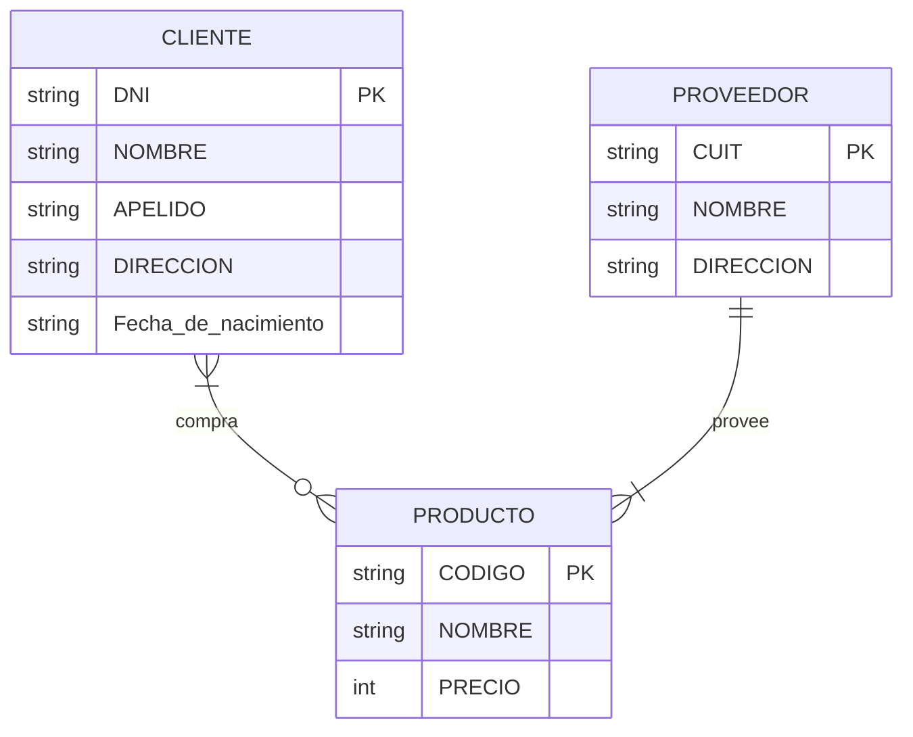
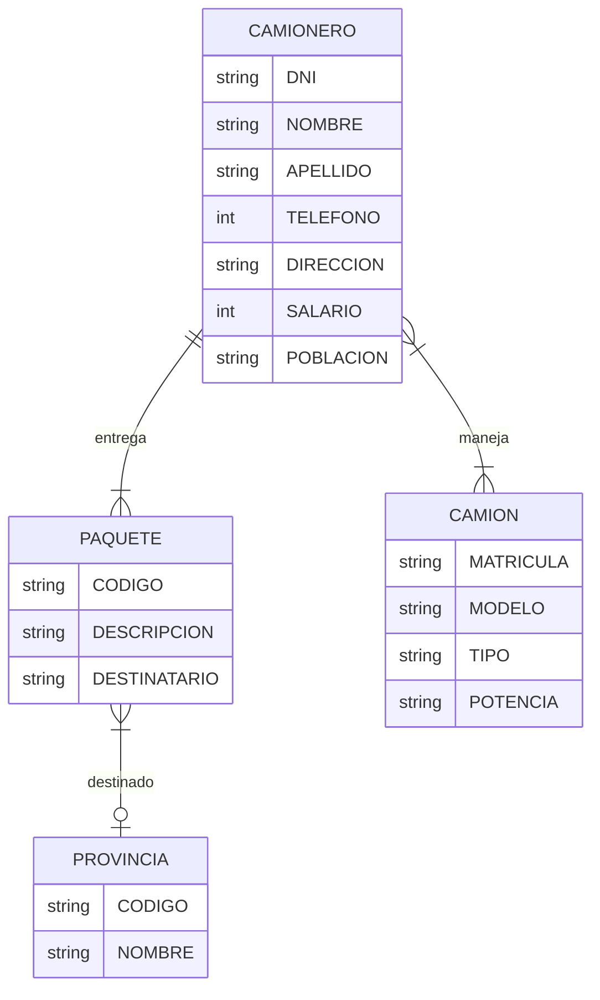

### Ejercicio 1.1
#TODO Hacer el DER
#### MR
Póliza(idPoliza, idCliente)
- PK = {idPoliza}
- CK = {idPoliza}
- FK = {idCliente}
Cliente(idCliente, nombre)
- PK = {idCliente}
- CK = {idCliente}
- FK = {}
Auto(patente, idPoliza)
- PK = {patente}
- CK = {patente}
- FK = {idPoliza}
Pago(fechaVto, fechaPago, idPoliza)
- PK = {{fechaVto, idPoliza}}
- CK = {{fechaVto, idPoliza}}
- FK = {idPoliza}
Accidente(fecha, patente)
- PK = {{fecha, patente}}
- CK = {{fecha, patente}}
- FK = {patente}

### Ejercicio 1.2
- Suponemos que cada auto tiene un único cliente asociado
- Cada poliza puede cubrir multiples autos y está asociada al cliente dueño

### Ejercicio 1.3

### Ejercicio 1.4

